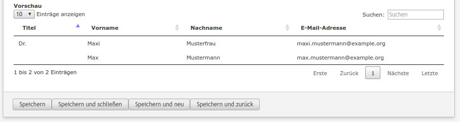

# Contao List Widget

This simple module offers functionality for displaying a list in the Contao backend (either as a dca field or in a backend module).

For visualization the javascript library [DataTables](https://github.com/DataTables/DataTables) is used.



## Features

- inputType "listWidget" for usage as a dca field
- convenient functions for integrating a list in your backend module
- the list can display either model data or even arbitrary arrays
- support for datatables javascript library
  - filter the table
  - search the table
  - sort the table
- support for ajax reloading data using datatables -> currently only working for contao models since SQL-commands like LIMIT are used

### Technical instructions

#### Usage as a widget in a dca field

Use the inputType "listWidget" for your field.

```
'someField' => [
    'label'     => &$GLOBALS['TL_LANG']['tl_my_dca']['someField'],
    'exclude'   => true,
    'inputType' => 'listWidget',
    'eval'      => [
        'listWidget' => [
            'ajax'                   => true,
            'ajaxConfig'             => [
                'load_items_callback' => ['SomeClass', 'loadItems']
            ],
            'header_fields_callback' => function ()
            {
                $arrHeaderFields = [];

                foreach (['academicTitle', 'additionalTitle', 'gender', 'lastname', 'email'] as $strField)
                {
                    $arrHeaderFields[$strField] = \HeimrichHannot\Haste\Dca\General::getLocalizedFieldname($strField, 'tl_dca');
                }

                return $arrHeaderFields;
            },
            'table'                  => 'tl_dca'
        ]
    ]
]
```

#### Usage in a module

Add the following code e.g. in the generate() method of your BackendModule:

```
static::$arrListConfig = [
    'identifier' => 'module_' . $this->id,
    'table' => 'tl_dca',
    'ajax' => true,
    'ajaxConfig' => [
        'load_items_callback' => function($arrConfig, $arrOptions = [], $objContext = null, $objDc = null) {
            return $this->loadItems($arrConfig, $arrOptions, $objContext, $objDc);
        },
        'prepare_items_callback' => function($objItems) {
            return $this->parseNewsletters($objItems);
        },
    ],
    'columns' => static::getColumns(),
    'language' => static::getLanguage()
];

static::$arrListConfig = ListWidget::prepareConfig(static::$arrListConfig, $this);

ListWidget::initAjaxLoading(static::$arrListConfig);
```

Call this in your module's compile method:

```
ListWidget::addToTemplate($this->Template, static::$arrListOptions);
```

Copy the content of list_widget.html5 into your module's template.

#### Example load_items_callback

Here you can see an example for overriding the core behavior of loadItems():

```
public static function loadItemsNew($arrConfig, $arrOptions = [], $objContext = null, $objDc = null)
{
    // set an initial filter using the contao options array
    $arrOptions = [
        'table'   => $arrConfig['table'],
        'columns' => $arrConfig['columns'],
        // filtering
        'column'  => 'pid',
        'value'   => $objDc->id
    ];

    // the rest of the function should also be called
    return ListWidget::loadItems($arrConfig, $arrOptions, $objContext, $objDc);
}
```

### Config (same structure for DCA -> eval -> listWidget and shortcut functions)

Name | Possible value | Description
---- | -------------- | -----------
identifier | string | Needed for distinguishing requests from multiple list widget implementations, e.g. ```'module_' . $this->id```
header_fields | array | Must return an array containing the header fields. The keys must match the keys of the arrays/objects in items/items_callback.
header_fields_callback | callback array, function closure | Must return an array containing the header fields. The keys must match the keys of the arrays/objects in items/items_callback.
items | array | Must return an array containing the items to be displayed. The item keys must match those in header_fields/header_fields_callback.
items_callback | callback array, function closure | Must return an array containing the items to be displayed. The item keys must match those in header_fields/header_fields_callback.
table | string (e.g. "tl_dca") | This value is needed for useDbAsHeader and ajax handling
useDbAsHeader | boolean | Set to true if the header should contain all fields of a certain database entity ("table" is used)
template | string | Specify a custom template
language | array | Specify custom localizations (see ListWidget::getLanguage() for details)
language_callback | callback array, function closure | Specify custom localizations (see ListWidget::getLanguage() for details)
ajax | boolean | Set to true if ajax reloading should take place (no need for items_callback in this case)
ajaxConfig -> load_items | array | Override this if custom model options or methods are needed (see ListWidget::loadItems() for details)
ajaxConfig -> load_items_callback | callback array, function closure | Override this if custom model options or methods are needed (see ListWidget::loadItems() for details)
ajaxConfig -> prepare_items | array | Override this if custom data preparation is needed (see ListWidget::prepareItems() for details)
ajaxConfig -> prepare_items_callback | callback array, function closure | Override this if custom data preparation is needed (see ListWidget::prepareItems() for details)

### Callbacks

Name | Arguments | Expected return value | Description
---- | --------- | --------------------- | -----------
headerFields_callback | $objDc, $arrDca, $objWidget | array containing field and label pairs (```['field1' => 'fieldLabel1', 'field2' => 'fieldLabel2', ...]```) | This callback must return the headerFields to be displayed in the list. Array keys need to be the keys in items_callback (see list_widget.html5 for explanation).
items_callback | $objDc, $arrDca, $objWidget | array of entity arrays (```[['field1' => 'value1', 'field2' => 'value2'], ...]```) | This callback must return the items to be displayed in the list
load_callback | $arrOptions, [], $objDc, $arrDca, $objWidget | data array (see ListWidget::loadItems for more details) | Override this method if custom model options or methods are needed
prepare_items_callback | $objItems, $arrListOptions, $arrOptions, $objDc, $arrDca, $objWidget | data array (see ListWidget::prepareItems for more details) | Override this method if custom data preparation is needed